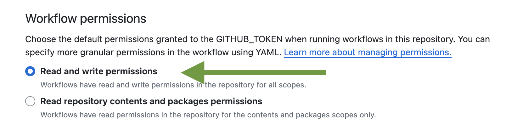

<div align="center">

<h1>Arturo Bundler</h1> 

### Easily bundle an Arturo app on any GitHub runner/OS<br><br> [](https://github.com/arturo-lang/bundler/actions)
</div>

---
 
<!--ts-->
   * [How do I use it?](#-how-do-i-use-it)
      * [More options](#more-options)
   * [How can I release an app?](#-how-can-i-release-an-app)
   * [FAQ](#-faq)
   * [License](#license)
<!--te-->

---

### 🌵 How do I use it?

The most barebones configuration would be:
```yaml
- uses: arturo-lang/bundler@main
  with: 
    token: ${{ secrets.GITHUB_TOKEN }}
    entry: yourscript.art
```

> [!TIP]
> The `entry` field represents your app's "entry point" - that is the initial script. Whether it imports other files/scripts or not doesn't matter, since it will - hopefully - be taken care of automatically. Also, you may choose to set the whole folder (in case it's an Arturo *package*) as the entry point: if it is a package with an `info.art` file that declares an `executable:`, it will work as well! 😜

Based on the runner and the specified OS/architecture, the action will compile and setup the appropriate native binary.

#### Supported platforms

| OS | Architecture | Runner |
|--------|--------|--------|
| Linux | amd64 | ubuntu-latest |
| Linux | arm64 | ubuntu-24.04-arm |
| macOS | amd64 | macos-15-intel |
| macOS | arm64 | macos-latest |
| Windows | amd64 | windows-latest |
| FreeBSD | amd64 | ubuntu-latest |

#### More options

| option | description |
|--------|-------------|
| os | target OS (linux, windows, macos, freebsd) - defaults to auto-detect from runner |
| arch | target architecture (amd64, arm64, native) - defaults to `'native'` (auto-detect from runner) |
| target | change the name of the final binary (default: `'auto'` = use the same name as the entry script) |
| version | set version number, to be included in the archive names - in the case of releases, this will be extracted automatically from the release tag (default: `''`) |
| release | prepare for release: creates a `.zip` archive with the binary (default: `'false'`) |

### 🔥 How can I release an app?

With Arturo's bundler and the appropriate setup, you can instantly offer binaries for all major OSes and architectures, as part of your GitHub repo's workflows.

But, panic not! We've got you covered! 😉

Actually it's very streamlined and easy:

- create a `.github/` folder inside your repo
- create a `workflows/` folder inside the above folder (in case it's not already there, obviously)
- create a new file in `./github/workflows/` (name it `asyouwish.yml`)
- copy the contents of [https://github.com/arturo-lang/bundler/blob/main/.github/workflows/testrelease.yml](https://github.com/arturo-lang/bundler/blob/main/.github/workflows/testrelease.yml)
- change only the relevant part above for your own app

> [!NOTE]
> The configuration you have to complete mainly includes 3 fields:
>  - `app-name:` The name of your binary as it will appear
>  - `app-entry:` The "entry point" of your app (see [above^](#how-do-i-use-it))
>  - `app-notes:` (Optionally) add some description that will appear at the bottom of the release

And done! 💥

Next time you push a new `vX.Y.Z` tag, a new release will be automatically created, along with all the binaries of your app for **Linux (amd64, arm64), macOS (amd64, arm64), Windows (amd64), and FreeBSD (amd64)**.

Sounds amazing? It actually *is*! 🚀

### 📖 FAQ

#### I have integrated the Release workflow, but it fails at the very last step!

If you had set up everything properly and come across a `Resource not accessible by integration` error at the last step, chances are you should simply give the action all necessary privileges.

How? Just go to your repo's *Settings* page, and then click on *Actions*. At the very bottom of the page, set your actions to have Read/Write permissions:



And... ready to rock'n'roll!

------

### License

MIT License

Copyright (c) 2025 Yanis Zafirópulos (aka Dr.Kameleon)

Permission is hereby granted, free of charge, to any person obtaining a copy
of this software and associated documentation files (the "Software"), to deal
in the Software without restriction, including without limitation the rights
to use, copy, modify, merge, publish, distribute, sublicense, and/or sell
copies of the Software, and to permit persons to whom the Software is
furnished to do so, subject to the following conditions:

The above copyright notice and this permission notice shall be included in all
copies or substantial portions of the Software.

THE SOFTWARE IS PROVIDED "AS IS", WITHOUT WARRANTY OF ANY KIND, EXPRESS OR
IMPLIED, INCLUDING BUT NOT LIMITED TO THE WARRANTIES OF MERCHANTABILITY,
FITNESS FOR A PARTICULAR PURPOSE AND NONINFRINGEMENT. IN NO EVENT SHALL THE
AUTHORS OR COPYRIGHT HOLDERS BE LIABLE FOR ANY CLAIM, DAMAGES OR OTHER
LIABILITY, WHETHER IN AN ACTION OF CONTRACT, TORT OR OTHERWISE, ARISING FROM,
OUT OF OR IN CONNECTION WITH THE SOFTWARE OR THE USE OR OTHER DEALINGS IN THE
SOFTWARE.